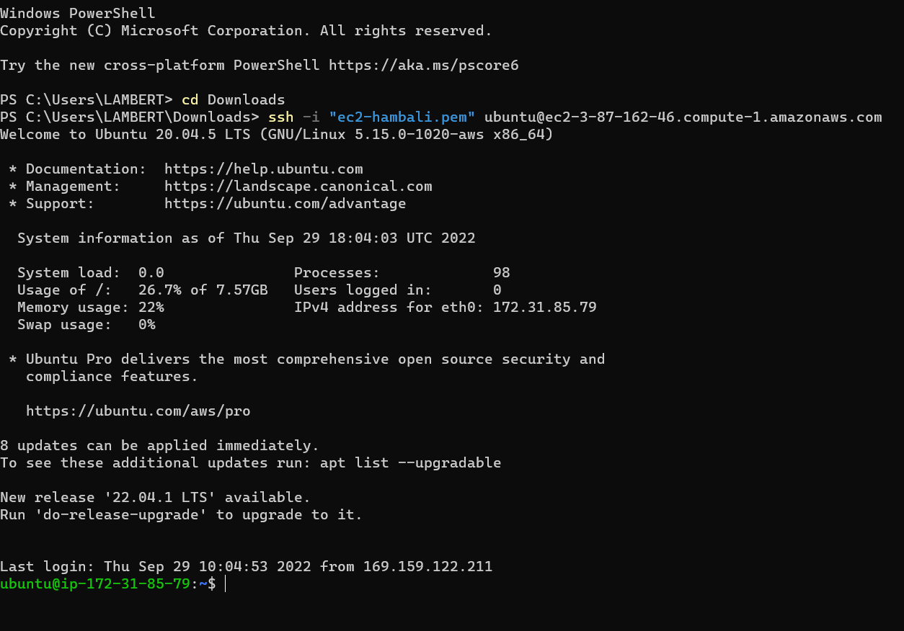
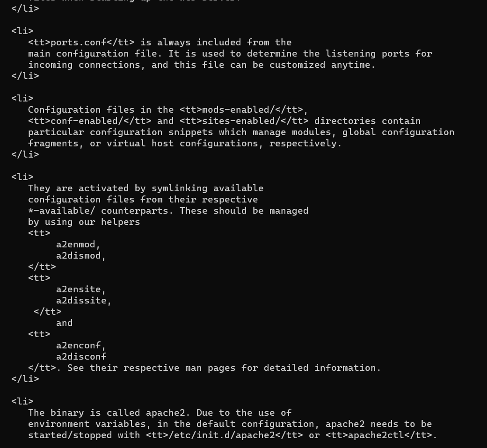
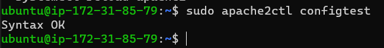

**PROJECT 1 DOCUMENTATION (LAMP IMPLEMENTATION)**

## Created a running ec2 instance on aws after my AWS account creation and selected a free tier, so easy.

## Created an active github account with no hurdle experienced. 

## I was succesfully able to connect to my created ec2 instance using window terminal following the procedures as was detailed in the PROJECT 1 instuctions/guide. I also tried to log into my created ec2 through PUTTY but to no avail after several attempts following number of video.

## Apache was succesfully istalled, using Ubuntu's package manager "Apt" with the code shown below
`sudo apt update`

## Confirming the status of already installed apache 
`sudo systemctl status apache2`

## Editting inbound rule to open inbound connection through port 80

## Login into web server through ubuntu shell
`curl http://localhost:80`

## Testing how the installed Apache HTTP server can respond to requests from the Internet.Opening a web browser Using the following url:
[login-to-web-server-on-chrome](https://3.87.162.46)
g

## Installation of MYSQL using 'apt'
`sudo apt install mysql-server`

## Running security script root user to create password, either low, medium or strong
`ALTER USER 'root'@'localhost' IDENTIFIED WITH mysql_native_password BY 'PassWord.1';`

## Then, exit MYSQL shell
`exit`

## Starting interractive scrip
`sudo mysql_secure_installation`

## After finishing the above, log in to MYSQL test was carried out
`sudo mysql -p`

## And finally exit MMYSQL console to proceed to step 3 of the project
`exit`

## Installation of three packages of PHP, libapache2-mod-php and php-mysql
`sudo apt install php libapache2-mod-php php-mysql`

## PHP version confirmed
`php -v`

## Setting up apache virtual host by firstly create directory for projectlamp
`sudo mkdir /var/www/projectlamp`

## Creation and opening of new configuration file in Apache's site
`sudo vi /etc/apache2/sites-available/projectlamp.conf`

## Using ls command to show the new file in the sites-available directory
`sudo ls /etc/apache2/sites-available`

## Enabling the new virtual host
`sudo a2ensite projectlamp`

## Confirming configuration file does not contain syntax error
`sudo apache2ctl configtest`

## Reloading apache for the change to take effect
`sudo systemctl reload apache2`

## Creating an index.html file
`sudo echo 'Hello LAMP from hostname' $(curl -s http://169.254.169.254/latest/meta-data/public-hostname) 'with public IP' $(curl -s http://169.254.169.254/latest/meta-data/public-ipv4) > /var/www/projectlamp/index.html`

## Surfing internet for the index.html file
[hello-LAMP,](https://44.203.53.92)
[Login-using-public-DNS](https://ec2-44-203-53-92.compute-1.amazonaws.com)

## Reloading apache for the change to take effect
`sudo systemctl reload apache2`

## Changing the order in which the index.php file is listed within the DirectoryIndex directive
`sudo vim /etc/apache2/mods-enabled/dir.conf`

## Reloading apache for the change to take effect
`sudo systemctl reload apache2`

## Creating a new file named index.php inside my custom web root folder
`vim /var/www/projectlamp/index.php`

## And finally, the fille created was removed because of the sensitive information about php environment ubuntu server it contains which can later be added
`sudo rm /var/www/projectlamp/index.php`

**THE PROJECT 1 IMPLEMENTATION AND DOCUMENTATION COMPLETED**